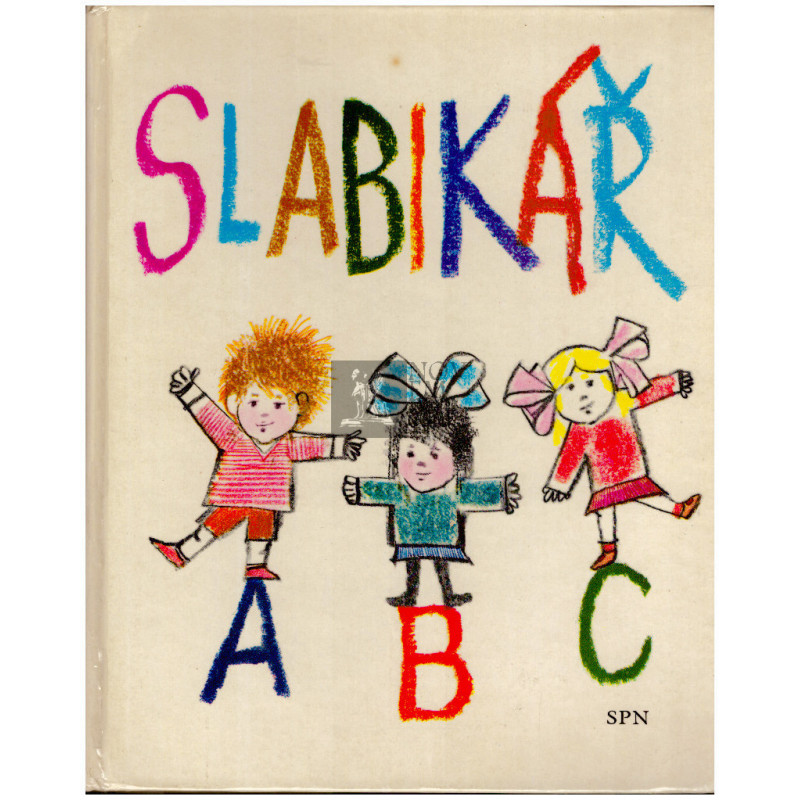

<!--
title: Jak psát moderní učebnice
theme: gaia
class:
 - invert
headingDivider: 2 
paginate: true
-->

<!--
_class:
 - lead
 - invert
-->

# Jak psát moderní učebnice

[Miroslav Suchý](mailto:msuchy@redhat.com), [Sergei Petrosian](mailto:spetrosi@redhat.com), [Lukáš Růžička](mailto:lruzicka@redhat.com)

## Učebnice je klasika



## Učebnice je klasika?


## Učebnice je klasika?

Trvanlivost a odolnost materiálu, mnohdy desítky let.


## Jenže...

Napsat učebnici trvá rok.

Vydat učebnici trvá taky rok.

V ICT jsou dva roky věčnost. Ale platí to i pro jiné obory.


## Takže...

V den vydání je učebnice prakticky dva roky stará.

## Errata

*Drobné aktualizace v kapitole 29 – Patologie GIT*

*Str. 509 a dále. Po odevzdání podkladů pro učebnici byla vydána nová WHO klasifikace nádorů trávicího systému, ve které byl „sesilní serrated adenom“ (SSA) přejmenován na „sesilní serrated lézi“ (SSL). Praktický dopad to má ten, že opět (po přibližně desetiletém intermezzu) platí staré pravidlo „každý adenom obsahuje dysplázie“ (protože SSA byl v tomto výjimkou).*

## Chuť k opravám

Různé formáty: Rukopis -> Nakladatelství -> Tiskárna

HTML, PDF a online publikace zpravidla nejsou původní zdroj.

Nízká bariéra pro opravy a úpravy.

## Požadavky na moderní učebnici

Tvorba a publikování lze dělat současně.

Učebnice jsou dostupné všem a zdarma (nebo za minimální poplatek).

Na vytváření učebnic může spolupracovat množství nezávislých autorů, dokonce i sami studenti.

Obsah lze měnit, přizpůsobovat a neustále vylepšovat.

Obsah lze jednoduše převést

## Komunitní dílo (+)

Jeden člověk vše neobsáhne.

Možnost použít jenom část díla.

Online přítomnost a aktuálnost.

## Komunitní dílo (-)

Autorské poplatky.

Neukážete to babičce.

## <!--fit--> Jak na to?

<!--
Tady si předáme slovo
-->

Je mnoho možností.

Ukážeme si jednu z mnoha.

## <!--fit--> Psaní dokumentace ve formátu "Docs-as-Code"

Principy Docs-as-Code:

- Správa verzí (Git)
- Umožňuje aby na tom projektu spolupracovalo víc lidi
- Kontrola změn kterou autor muže delegovat
- Asynchronní spolupráce (každý, kdy má čas)
- Automatické testování, generování, a publikace materiálů
- Psaní ve značkovacích jazycích (Markdown, AsciiDoc, LateX, atd.) namísto WYSIWYG (LibreOffice, MS Word)

## Zápis jazyka Markdown

```md
# Název
## Kapitola 1. Tučné písmo, kurzíva, a monospace
Tento řádek obsahuje **tučné písmo**, *kurzívu*, a `monospace`

### Podkapitola 1.1. Číslovaný seznam pomocí čisel
1. Řádek 1
2. Řádek 2

## Kapitola 2. Seznam odrážek pomocí pomlček
- Řádek 1
 - Podřádek 1.1
- Řádek 2

## Kapitola 3. Odkazy
[Seznam.cz](https://www.seznam.cz/)
```

## Převod souboru v rozšíření Markdown

K převodu textových souborů lze použít k tomu určené nástroje, jako například:
- [pandoc](https://pandoc.org/)
- [Marp](https://marp.app/)
- [kramdown](https://kramdown.gettalong.org/)

<!--
Tady bude ukázka převod příkladu do HTML pomocí pandoc
-->

## Jak je tato prezentace vytvořena

Tato prezentace je vytvořena pomocí [Marp](https://marp.app/) a [Marp Action](https://github.com/ralexander-phi/marp-action), které umožňují automatické nasazení prezentace na web pomocí [GitHub Pages](https://pages.github.com/).

Tato prezentace je vygenerovaná z Markdown souboru `README.md`:
https://github.com/spetrosi/jak_psat_moderni_ucebnice/blob/master/README.md

GitHub Pages automatické publikuje slajdy na web:
https://spetrosi.github.io/jak_psat_moderni_ucebnice/

<!--
Tady bude ukázka převod slajdů z README.md do HTML a PDF pomocí marp
-->

## Co když Markdown pro moje účely nestačí?

AsciiDoc je další značkovací jazyk který má větší funkcionalitu a dokáže mnohem víc. Například je schopen plnit následující úkoly:
- AsciiDoc poskytuje sofistikovaněji strukturu dokumentů
- Pomocí direktivy `include::` lze přidávat obsah souborů přímo do stávajícího textu
- Lze využit proměnné pro opakované použití stejného obsahu
- Lze použit HTML poznámky a upozornění
- Lze nechat automaticky vygenerovat obsah

## Příklad dokumentace v AsciiDocu

Dokumentace __The Foreman__ je psána v AsciiDocu.

- Cílová stránka: https://docs.theforeman.org/
- Zdroj dokumentace nahází na GitHubu: https://github.com/theforeman/foreman-documentation

<!--
Tady bude ukázka jak Foreman docs používají AsciiDoc pro generace své dokumentace
-->

<!--
Tady si předáme slovo
-->

## Demo ukázka

Jak rychle a jednodušše začít psát knihy způsobem *as-code* pomocí [Githubu](github.com) a *Github pages*:

- založení repozitáře
- potřebné nastavení repozitáře
- editace na hlavní větvi a generování obsahu
- editace na vývojové větvi
- sloučení vývojové do hlavní větve a generování obsahu

##  Co k tomu budeme potřebovat?

- počítač s textovým editorem schopným psát "čistý" text (Notepad, Atom, VisualCode)
- přístup na internet
- účet na on-line repozitáři (Github)
- program na správu verzí (Git) (volitelně)

# 🎉
<!--
_class:
 - lead
 - invert
-->
### Otázky a odpovědi
